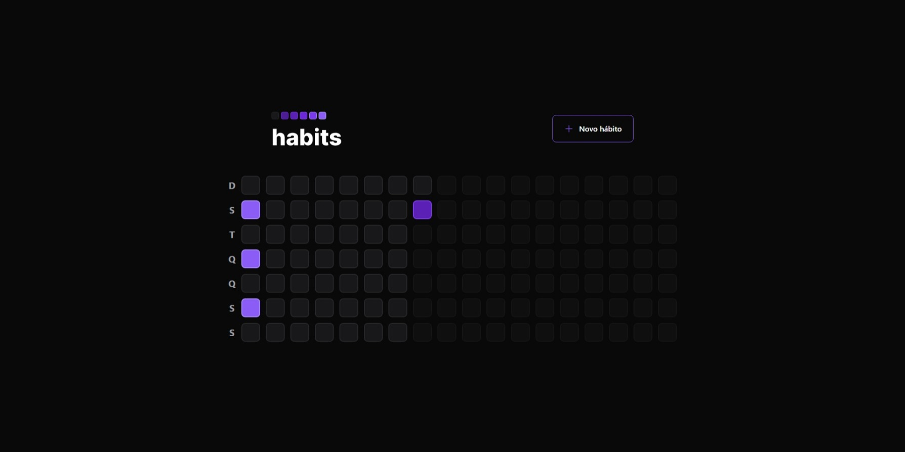

# Habits

## 🦾 Tecnologias

- Typescript
- DayJS
- Zod
- Prisma
- Mermaid
- TSX
- Vite
- TailwindCSS
- NativeWind
- RadixUI
- Axios
- Node.js
- Fastify
- React
- Expo
- React Native

- Git e Github

## ⚙️ Sobre o projeto

- Foi feita uma aplicação durante o evento da NLW da RocketSeat que consiste em criar habitos para o dia a dia e seguir com a evolução diaria

## 👨🏻‍🏫 Instruções

- Comando para baixar o node_modules Yarn
- Para iniciar a aplicação deverar executar Yarn dev / npm run dev

## ❤️ Contato

julionev@gmail.com
